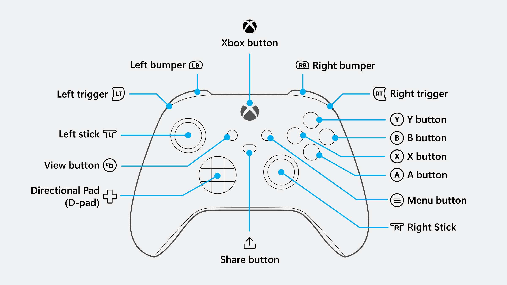

# Pharaoh: A New Era Gamepad support Mod

Greetings to thee, O Pharaoh,
The splendid game lacks support for gamepad control, and our scribes have resolved to amend this.

In this, the offered modification "PANEGamepad" shall aid thee. On how to install it, read at the end of this papyrus. And here, thy nomarch shall recount what changes in the game’s command.

## Gamepad in game

Modification use native XInput support for gamemad so every controllers which support it or emulated should be supported.

I will use ['XBox One' styled notation](https://https://support.xbox.com/en-US/help/hardware-network/controller/xbox-one-wireless-controller) to describe buttons.

Almost everytime gamepad just mimic keyboard or mouse pressing, with some adoptation to current game situation, so it required that your in-game keyboard binding is default.

## General control

* **D-Pad** - will move your mouse to closest interface element in specified direction.
* **A** - Confirm or Select or Left Click (=> Left mouse button). This almost every where to click on specified items.
* **B** - Cancel or Right Click (=> Right mouse button). Usualy to close notification or select flat mode for building.
* **Left thumbstick** - to Move mouse in any direction - more shifted - faster speed.
* **Right thumbstick** - to Pan Map in specified direction (=> WASD), or Scroll Up/Down - if mouse over scrollable elements.
* **LB** / **RB** - Zoom In / Zoom Out Map (=> Pg Up/Pg Down), or Jump between Tabs (if present).

Conrol optimized to be more comfortable in different game 'scenes'.

## Main game

* **D-Pad** - jump to side panel and navigate within panel.
* **X** - Pick building
* **Y** - Undo
* **Menu** - Main Menu (Load/Save)
* **View** - ??? General overseers
* **LT+A** - House
* **LT+B** - Remove
* **LT+X** - Road
* **LT+Y** - Roadblock
* **LT+DPad Up** - Commerse observer /Previous Overseer
* **LT+DPad Down** - Granaries Overseer / Next Overseer
* **LT+DPad Left** -
* **LT+DPad Right** -
* **LT+LB** - Decrease Speed
* **LT+RB** - Increase Speed
* **LT+View** - Pause

?? Gardens
?? Plaza
?? Comerse Observer
?? WordMap

**inside panels**:

* **D-Pad** - navigate between panel elements. No jumps outside.
* **A** - open dropdown or select item and jump back to previous mouse location (before D-Pad was pressed first time)
* **B** - cancel selection and and jump back.
* **Left stick move** - move mouse and cancel 'panel mode'.

Main Game Scene is common gameplay scene when you see game map, left panel, top panel, right building panel and minimap. And this not covered by obstacles like big poppups notifications.

During this mod prefere to select and stick to buttons at side bar.

Thus if your mouse was moved somewere in center and you press D-Pad Right - mouse will jump onto closes available button on Building panel. Sequenced press on D-Pad direction will move cursor within Building Panel buttons and will not jump outside.

To release - you can: press 'A' to select item, or 'B' to cancel selection, or just touch left stick to move mouse manualy.

### Pick item function

If you did not moved mouse manualy while navigating panel - it wil remember mouse original position and restore it on cancelation or building selection. This will help easily to pick item using D-Pad and return back to your city.

*This also works on Keyboard cursor and then Enter button*

## Single button scenes

There are scenes with only one button 'Proceed' on screen, or even no buttons. E.g. intro video or after loading.

Just press 'A' button to continue on this screen.

##

#TODO:
- More buttons to assign
- General: Scroll by RStick
- World map: navigate within trade - cities only
- Skip Inactive 'Accept' button within delivery request
- 'ResetScene to remove 'fake focus' on changed scenes
- Zoom by trigger
- Configurable mapping
- Consumed Input list

